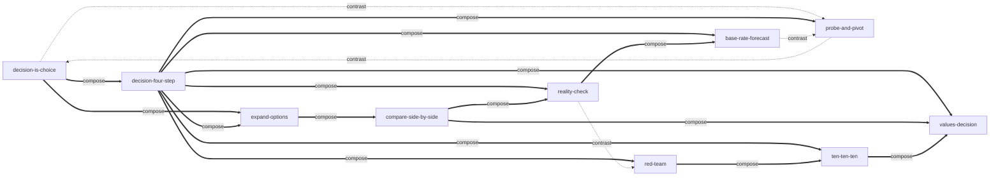

# 《决断》— Skill Index

> 本书由 cangjie-skill 蒸馏, 共产出 **10** 个 skills。
> 处理时间: 2026-08-14

## 关于这本书

- **作者**: Chip Heath & Dan Heath (奇普·希思 & 丹·希思), 万维钢·精英日课解读
- **出版年**: 原书 2013 / 解读 2017
- **一句话主旨**: 面对难分优劣的多个选项时,用「扩充选项 → 现实检验 → 长远考虑 → 为错误做准备」四步程序替代直觉拍板,并借反对派、旁观者、价值观、基础比率与试水等武器,做出比自动驾驶更靠谱的选择。
- **整书理解**: 见 [BOOK_OVERVIEW.md](./BOOK_OVERVIEW.md)
- **术语词典**: [GLOSSARY.md](./GLOSSARY.md)
- **精华长文**: [DIGEST.md](./DIGEST.md) (阶段 5 生成)

---

## Skill 列表 (按决策时序分组)

### 入口层
- [`decision-is-choice`](./decision-is-choice/SKILL.md) — 决策前提检查:是不是真决策?有没有 ≥ 2 个真实备选?
- [`decision-four-step`](./decision-four-step/SKILL.md) — 科学决策四步法总纲(扩充/检验/长远/兜底)

### 选项生成层
- [`expand-options`](./expand-options/SKILL.md) — 增加选项:借鉴 + 寻找亮点(从二元改多选)
- [`compare-side-by-side`](./compare-side-by-side/SKILL.md) — 同时参选:统一摆桌面比较(防逐个看走眼)

### 评估与纠偏层
- [`reality-check`](./reality-check/SKILL.md) — 多源求证,警惕确认偏误
- [`red-team`](./red-team/SKILL.md) — 蓝军反对派,程序化唱反调
- [`ten-ten-ten`](./ten-ten-ten/SKILL.md) — 10/10/10 旁观者,剥离短期情绪
- [`values-decision`](./values-decision/SKILL.md) — 价值观优先级,利弊算不清时的终局判据

### 预测与执行层
- [`base-rate-forecast`](./base-rate-forecast/SKILL.md) — 基础比率预测 + 特殊因素修正(信数据)
- [`probe-and-pivot`](./probe-and-pivot/SKILL.md) — 试水法 + 保金斯基三原则(信行动)

---

## 引用图



**图例**:
- `===>` composes-with (组合使用,前者常调用后者)
- `-.->` contrasts-with (两种可选方案,看情境选一)
- (本书内无 depends-on 关系 — 因四步法是"编排者"而非"前置依赖";典型调用流见下方"推荐调用顺序")

**核心张力**: `base-rate-forecast` 与 `probe-and-pivot` 是 *信数据 vs 信行动* 的对照,选择取决于决策可逆性(可逆→试水,不可逆→基础比率)。

---

## 推荐调用顺序

(从入口开始,按决策时序)

1. **`decision-is-choice`** — 先识别是不是真决策(否则所有方法都失效)
2. **`expand-options`** — 若无选项,先加选项(打破 yes/no 二元)
3. **`decision-four-step`** — 进入总纲,定位卡点(选项/评估/决心/兜底四步)
4. **按卡点委派**:
   - 卡选项不够 → `expand-options`
   - 卡评估有偏 → `reality-check` + `red-team`
   - 卡下不了决心 → `ten-ten-ten` + `values-decision`
   - 卡准备失败 → `probe-and-pivot`(可逆)/ `base-rate-forecast`(不可逆)
5. **`compare-side-by-side`** — 比较与定盘阶段(若有多方案统一呈现需求)

---

## 安装使用

本目录是构建产物,宿主不会从这里加载 skill。要让 agent 真正调用, 把 skill 目录复制到宿主的 skills 目录:

```bash
# 用户级 (所有项目可用)
cp -r decision-is-choice decision-four-step expand-options compare-side-by-side \
      reality-check red-team ten-ten-ten values-decision base-rate-forecast probe-and-pivot \
      ~/.claude/skills/

# 或项目级
mkdir -p <project>/.claude/skills/
cp -r decision-* expand-options compare-side-by-side reality-check red-team \
      ten-ten-ten values-decision base-rate-forecast probe-and-pivot \
      <project>/.claude/skills/
```

---

## 接入 darwin-skill

所有 skill 的 E 段均内建 🔴CHECKPOINT/🛑STOP + if-fail 三段式兜底 (CLAUDE.md 经验值 dim4≥7 / dim3≥8);阶段 4 补 test-prompts.json 后可直接接入 darwin 自动进化:

```
darwin evolve output/jueduan-decision/
```

---

## 审计轨迹

- **整书理解**: [BOOK_OVERVIEW.md](./BOOK_OVERVIEW.md)
- **验证通过清单**: [verified.md](./verified.md) (38 条通过 V1/V2/V3)
- **被淘汰候选**: [rejected/](./rejected/) (10 条 + p15 复审轨迹)
- **候选单元池**: [candidates/](./candidates/) (框架18 + 原则30 + 反例22 + 术语17 + 案例30)
- **共享术语词典**: [GLOSSARY.md](./GLOSSARY.md)